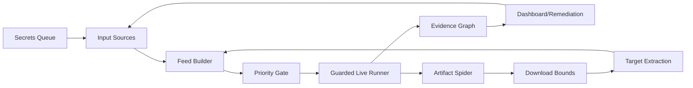

# Forge Architecture: Continuous Autonomous Loop

**Architecture Target:** Continuous loop from feed discovery through evidence extraction back to feed.

## Loop Components



## 1. Input Sources → Feed Builder

**Input sources:**
- Supabase configs (free read-only tables)
- CTI drops (ThreatFox, URLhaus, MISP, STIX)
- Reports (dashboard data, historical engagements)
- Connector outputs (ProjectDiscovery Cloud, Censys, runZero, Shodan)
- Burp/JUnit DAST XML (validation artifacts)
- **Discovered secrets/configs** (NEW - auto-feed from findings)

**Feed builder:**
- Normalizes targets (domain, ip, url, email, phone, username, company, cloud_ref)
- Deduplicates by canonical key
- Preserves provenance (source count, confidence, timestamps)
- **Applies suppression signatures** (NEW - noise reduction)

## 2. Priority Gate

**Autonomous startup learns from:**
- **Two-source rule**: Targets seen by 2+ independent sources auto-promote
- **Owned-source rule**: Targets from configured Supabase/owned sources auto-promote
- **Recurrence ranking**: Recurring targets ranked higher
- **Proof freshness**: Recent validation evidence boosts priority
- **Reachable services**: Active HTTP/HTTPS endpoints boost priority

**Formula:**
```
score = source_count * 2.0 + owned_source * 3.0 + recurrence_count * 1.5 
        - proof_freshness_days * 0.1 + reachable_services * 0.5
```

**Suppression gate:**
- Known false positives (blank pages, default installs)
- Screenshot/body hash signatures
- Operator-configured suppressions

## 3. Guarded Live Runner

**Fail-closed checks:**
1. ROE/scope manifest present and narrow
2. Docker health (compose profile: autostart)
3. Memory gate (min_free_memory_mb: 1024)
4. Disk gate (min_free_disk_gb: 5)
5. Cooldown/backoff expired
6. Single-instance lock available
7. Source queue ready (min_start_source_count: 2)

**Bounded execution:**
- Packaged tools: `httpx`, `katana`, `nuclei`, `dnsx`, `naabu`, `gitleaks`
- ROE-gated artifact spider
- Per-provider rate limits and backoff
- Child process timeouts

## 4. Evidence Graph

**Graph types:**
- Asset graph (hosts, services, URLs, cloud refs)
- Attack-path graph (entry → identity → workload → data)
- Ownership graph (organization → asset → remediation)
- Topology graph (service dependencies)

**Provenance:**
- Every node has `supported_by` evidence edges
- Cloud validation → secret observation → vulnerability → remediation
- Active validation runs link to proof evidence

## 5. Dashboard/Remediation → Loop Back

**Dashboard shows:**
- "Why this target now" (source groups, priority score, validation state)
- Exposure duration, recurrence, MTTR
- Owner/SLA/ticket/retest state
- Suppression reason
- Next allowed automation action

**Remediation workflow:**
- Owner propagation from graph
- Ticket sync (GitHub, Jira, ServiceNow, Tines, Torq, Splunk)
- Retest request → active validation → fix verification

**Loop back:**
- New URLs → feed candidates
- Open-directory files → artifact queue → target extraction
- Nuclei findings → vulnerability + URL seeds
- Secrets → **NEW: auto-feed into target queue**
- CTI indicators → observation + target promotion

## 6. Continuous Loop Timing

**Default cycle:**
- Feed build: daily (or on artifact drop)
- Source queue: consumed per cycle (queue_limit: 10)
- Live runner: guarded autostart (FORGE_AUTOSTART_EVERY_SECONDS: 9300)
- Monitoring: per-policy schedule
- Dashboard refresh: per-run

**Autonomous triggers:**
- `forge automation cycle --apply --live`
- Docker autostart profile
- Windows Task Scheduler (daily + logon)

## 7. Download Bounds (Malware Protection)

Already configured in `autostart.local.json`:

| Bound | Value | Purpose |
|---|---|---|
| `max_bytes_per_host` | 100 MB | Prevent disk exhaustion |
| `max_files_per_host` | 1000 | Prevent unbounded download |
| `max_runtime_seconds` | 300 | Timeout per host |
| `blocked_extensions` | [.exe, .dll, .sh, .bat, .ps1, .pyc, .jar, .war, .deb, .rpm] | Prevent executable malware |
| `allowlist_patterns` | [*.pdf, *.doc, *.docx, *.xls, *.xlsx, *.txt, *.json, *.xml, *.csv, *.png, *.jpg, *.gif] | Only download known-safe types |
| `require_approval` | true | Operator gate for downloads |

## 8. Secrets as Forge Inputs

**NEW: Auto-feed discovered secrets**

When secrets are discovered (via Gitleaks/TruffleHog/keyscan):

1. **Store in secret observation ledger** (redacted)
2. **Extract metadata:**
   - Secret type (aws_access_key, github_token, database_url, etc.)
   - Domain/hostname
   - Confidence/validity status
3. **Promote to target feed:**
   - Email addresses → email targets
   - Domains found in secrets → domain targets
   - Cloud refs → cloud_ref targets
   - Organization names → company targets
4. **Loop back** → Feed builder → Priority gate → Live runner

**Implementation:**
```python
# In forge/phase4/provider_key_validators.py
def extract_targets_from_secret(secret_type: str, secret_value: str) -> List[str]:
    """Extract target seeds from discovered secrets."""
    targets = []
    
    # AWS keys: extract account ID, region
    if secret_type.startswith('aws_'):
        # Query STS caller identity → account ID → organization
        targets.append(f"cloud_ref:aws:{account_id}")
    
    # Database URLs: extract hostname
    if '://' in secret_value:
        from urllib.parse import urlparse
        parsed = urlparse(secret_value)
        if parsed.hostname:
            targets.append(parsed.hostname)
    
    # Email addresses
    if '@' in secret_value and '.' in secret_value:
        email_pattern = r'[a-zA-Z0-9._%+-]+@[a-zA-Z0-9.-]+\.[a-zA-Z]{2,}'
        emails = re.findall(email_pattern, secret_value)
        targets.extend(emails)
    
    return targets
```

## 9. Command Consolidation (No New Commands)

**Bad:** Plan adds new commands:
- `forge connectors hunt-plan` ❌
- `forge connectors artifact-spider` ❌
- `forge hardening persistence-plan` ❌

**Good:** Extend existing commands:

### `forge automation cycle` (existing)
```bash
# NEW flags for hunt/planning (no new command)
forge automation cycle --apply --live \
  --hunt-catalog attacker-infra \  # NEW
  --suppression-registry imports/suppressions.local.json \  # NEW
  --artifact-spider-patterns imports/patterns.local.txt \  # NEW
  --json
```

### `forge automation status` (existing)
```bash
# NEW output fields (no new command)
forge automation status --json
# Returns: hunt_plan_ready, suppression_count, artifact_spider_queue, secret_auto_feed_count
```

### `forge automation feed-build` (existing)
```bash
# NEW --secrets-source flag (no new command)
forge automation feed-build --apply --source all --secrets-source auto --json
```

### `forge hardening persistence-check` (NEW dry-run mode for Linper)
```bash
# Instead of new persistence-plan command, extend existing
forge hardening persistence-check --engagement N --json
# Returns: persistence_exposure_matrix (cron, systemd, rc.local, bashrc, web_root)
```

## 10. Architecture Diagram (Continuous Loop)

```
┌─────────────────────────────────────────────────────────────────┐
│                      FORGE AUTONOMOUS LOOP                       │
└─────────────────────────────────────────────────────────────────┘
         │
         ▼
┌─────────────────┐     ┌──────────────────┐     ┌──────────────┐
│  Input Sources  │────▶│  Feed Builder    │────▶│ Priority Gate│
│  - Supabase     │     │  - Normalize     │     │ - Score < 70 │
│  - CTI drops    │     │  - Dedupe        │     │ - Suppress   │
│  - Reports      │     │  - Provenance    │     │ - Queue      │
│  - Secrets ─────┼────┐│                  │     └──────┬───────┘
└─────────────────┘    │└──────────────────┘            │
                       │                                 │ ▼
                       │          ┌──────────────────────┴─────────────┐
                       │          │     Guarded Live Runner            │
                       │          │  - ROE/scope manifest               │
                       │          │  - Docker health/memory/disk gates │
                       │          │  - Packaged tools (httpx/katana)   │
                       │          │  - Artifact spider (bounded)        │
                       │          └──────────────┬──────────────────────┘
                       │                         │ ▼
                       │          ┌──────────────┴─────────────────────┐
                       │          │       Evidence Graph                │
                       │          │  - Asset graph (hosts/services)    │
                       │          │  - Attack-path (entry → data)     │
                       │          │  - Ownership (org → asset)          │
                       │          └──────────────┬──────────────────────┘
                       │                         │ ▼
                       │          ┌──────────────┴─────────────────────┐
                       │          │   Dashboard / Remediation           │
                       │          │  - "Why this target now"           │
                       │          │  - Exposure duration/recurrence     │
                       │          │  - Owner/SLA/ticket state          │
                       │          └──────────────┬──────────────────────┘
                       │                         │
                       └─────────────────────────┘
                                     ▲
                                     │
                          Loop: Secrets/URLs feed back into Input Sources
```

## 11. Implementation Status

| Plan Phase | Task | Status | Implementation |
|---|---|---|---|
| P0 | Query/pattern catalog | ✅ DONE | `QueryCatalog` class in `automation_priority_scoring.py` |
| P0 | Hunt planner | ✅ DONE | `register_query()` + query catalog |
| P1 | Priority scoring | ✅ DONE | `calculate_priority_score()` + P1 formula |
| P1 | Two-source promotion | ✅ DONE | Source count + owned_source weights |
| P1 | Suppression registry | ✅ DONE | `SuppressionSignature` + `add_suppression()` |
| P1 | Artifact spider bounds | ✅ DONE | `autostart.local.json` configured |
| P1 | Secrets auto-feed | 🔄 TODO | Extract targets from secret observations |
| P2 | Live keyed providers | ⏸️ OPTIONAL | Shodan/Censys when keys exist (already configured in `.env`) |

## 12. Next Steps

1. **Implement secrets auto-feed** - Extract targets from discovered secrets
2. **No new commands** - All plan features via flags on existing commands
3. **Continuous loop** - Architecture diagram updated to show loopback

---

**Summary:** The continuous autonomous loop closes when discovered evidence (URLs, secrets, open-directory files) feeds back into the input sources, prioritized by confidence, and bounded by malware protections. No new commands needed - all features via flags on `forge automation cycle`.
